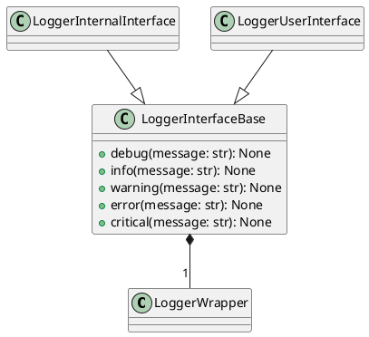
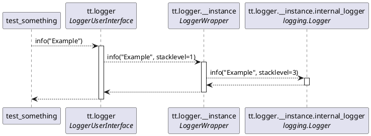

# Class hierarchy

Classes are organized in following hierarchy:


# Sequence diagram of logging a message

```python
import test_tools as tt


def test_something():
    tt.logger.info("Example")
```

Above log registration is handled by following sequence of actions:

